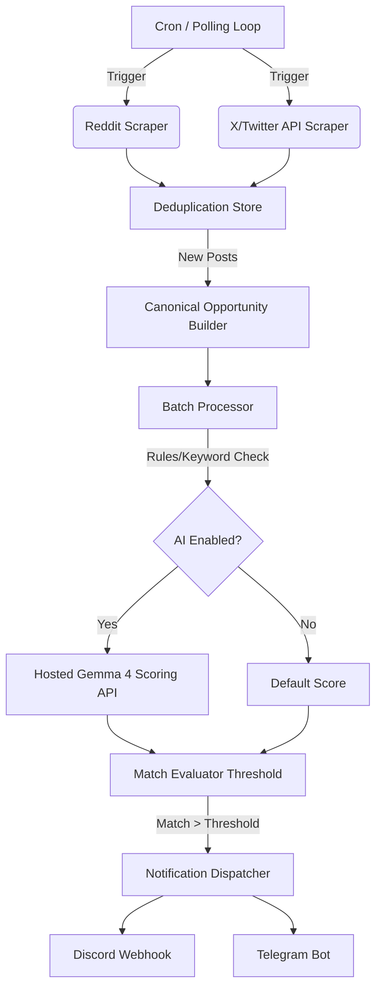

# Application Architecture: Reddit Hire Notifier / Job Finder

## Overview

The application is a TypeScript-based automated opportunity discovery system. It polls multiple sources (Reddit and X/Twitter) for hiring or contract opportunities, normalizes the data, applies heuristic filtering, optionally scores candidates via a hosted Google Gemma 4 AI model, and delivers high-quality matches to notification channels like Discord and Telegram.

The primary goal is to find precise, highly relevant job leads while minimizing noise and API costs.

## High-Level Flow

## Core Components

### 1. Orchestration Layer (`src/index.ts`)
The `RedditHireNotifier` class coordinates the entire lifecycle:
- Validates the environment and schema (`src/config/schema.ts`).
- Initializes rate-limited HTTP clients, scraping instances, and stores.
- Manages an internal polling loop (configurable via `POLL_INTERVAL_MS`).
- Exposes an Express.js server for metrics and health checks (`/metrics`, `/health`).
- Manages asynchronous queuing and batching of incoming jobs.

### 2. Ingestion Layer
The application supports multiple ingestion sources, unifying them into a common `RedditPost` (legacy name for multi-source post) structure.

- **Reddit Scraper (`src/lib/scraper.ts`)**: Uses Puppeteer and Cheerio to load `old.reddit.com/r/<subreddit>/new/`. Parses HTML to bypass standard API rate limits while respecting `robots.txt` compliance and delays.
- **X Search Scraper (`src/lib/x-scraper.ts`)**: Uses the official X (Twitter) API (`/2/tweets/search/recent`) with a bearer token. Configured with specific queries and maximum engagement thresholds to find niche, uncrowded leads.

### 3. Canonical Normalization (`src/lib/opportunity.ts`)
Raw posts from Reddit or X are converted into a `CanonicalOpportunity` object.
- **Why?** It abstracts away the source platform. Downstream layers (Rules, AI, Notifications) interact with a single format containing normalized titles, outbound URLs, flairs, and engagement metrics.
- Prioritization is computed via `calculateOutreachScore()`, allowing the batch processor to process the highest-potential leads first.

### 4. Storage & Deduplication (`src/lib/store/`)
Before evaluating jobs, the system checks if a post has been seen before using its unique ID (`post.id` or `x:post.id`).
- **MemoryStore**: Stores IDs in memory (lost on restart, good for development).
- **SqliteStore**: Persists seen IDs to a local database file (production recommended).

### 5. Matching and Batch Processing (`src/lib/batch-processor.ts`)
Instead of evaluating posts one by one, the `BatchProcessor` handles them in groups to optimize AI API usage.
- **Keyword Filtering**: A fast, cheap heuristic pass that drops obvious noise or blacklisted terms (e.g., "hire me" vs. "hiring").
- **AI Scoring (`src/lib/gemini.ts`)**: Posts that pass keywords are grouped and sent to the Google Gemini API (using the `gemma-4-26b-a4b-it` model by default). The LLM is prompted to score the candidate's relevance to the target profile on a 0.0 - 1.0 scale.
- Candidates meeting the configured threshold (e.g., `> 0.7`) are yielded as `MatchResult` objects.

### 6. Notification Layer (`src/lib/notifier.ts`, `src/lib/telegram-notifier.ts`)
Distributes final matched opportunities to configured channels:
- **DiscordNotifier**: Posts an embedded rich message via a Discord Webhook.
- **TelegramNotifier**: Posts a structured Markdown message to a specified Telegram Chat ID.

Both channels include metrics, canonical data, AI fit scores, and direct links to the original post.

### 7. Telemetry & Metrics
An embedded Express server (`PORT` configurable) provides:
- **`/health`**: Uptime, running state, and basic counters.
- **`/metrics`**: Prometheus-formatted metrics including total scrapes, matches, notifications, errors, and last scrape timestamps.

## Infrastructure and Deployment

- **Environment**: Configured via `.env` files matching the `Config` interface.
- **Robustness**: Relies on a unified `HttpClient` that performs automatic retries, exponential backoffs, and respects custom User-Agents and HTTP proxies.
- **Docker**: Containerized via Dockerfile/docker-compose for isolated deployments.
- **Graceful Shutdown**: Traps `SIGINT`/`SIGTERM` to allow the current processing batches to drain, clean up SQLite connections, and close Puppeteer browsers before exiting.
